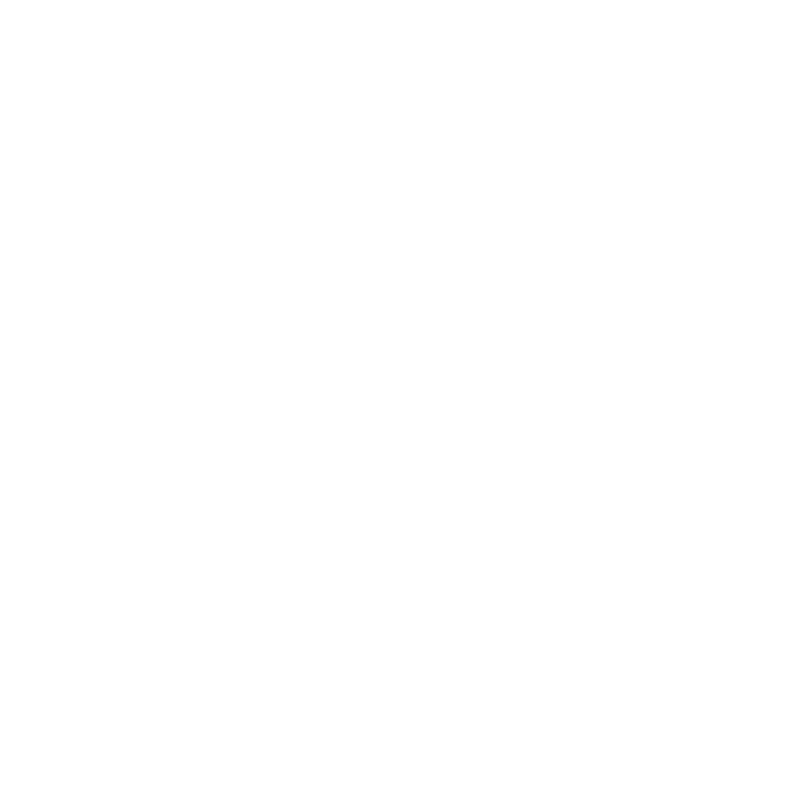
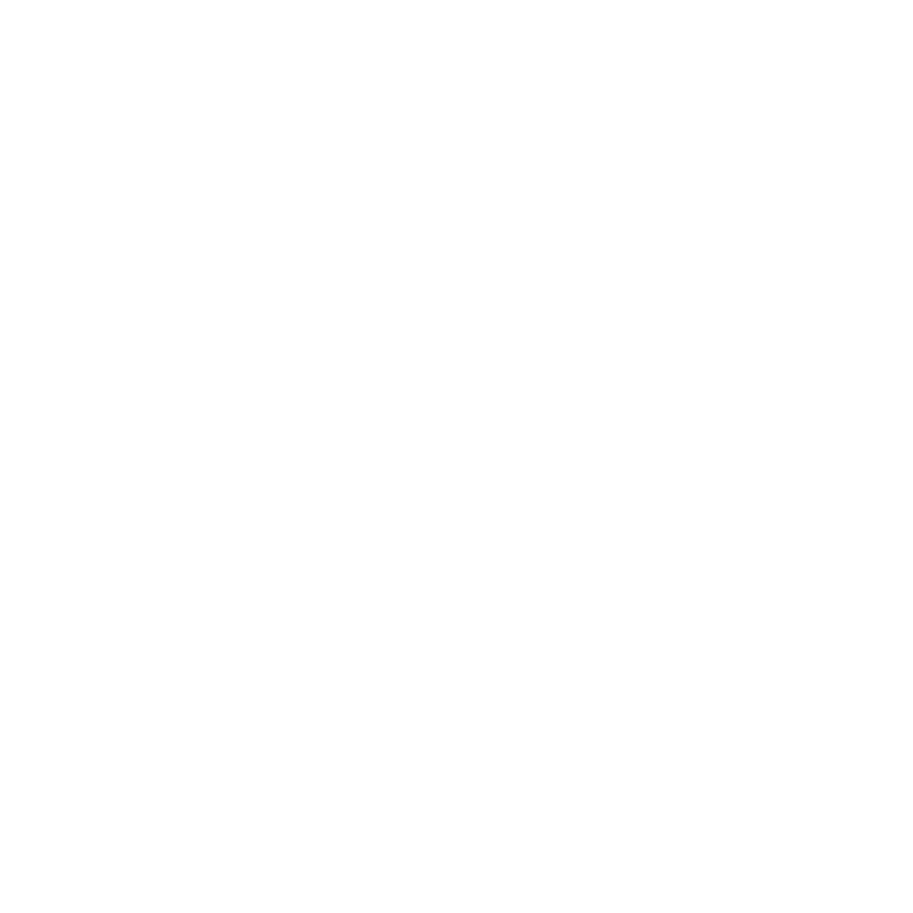
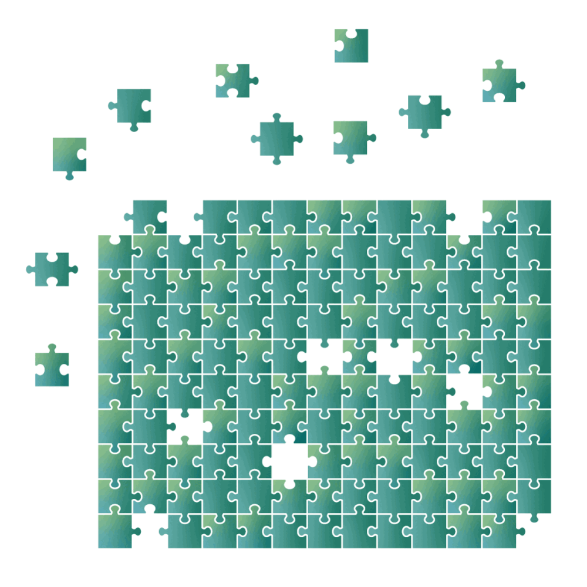

 

# [Classic Puzzle Maker](https://krishealty.github.io/puzzle/example.html)

A simple implementation of the classic mini-game Fifteen Sliding Puzzle, using HTML DOM document elements and without using Canvas or third party libraries. 

When mixing a picture, random replacement of slots is not used, only natural mixing by moving a free slot, thanks to this, an error is excluded, due to which the puzzle may not be assembled.

By solving the puzzle, you can move several blocks in a column and a row in one move. You can set controls for the GamePad and keyboard.

The engine code is very flexible for modifications, has many settings and can be integrated into any web page or web app.

Thanks [krystal carpintieri](https://www.krystalcarpintieri.com/home/puzzle-animated-gifs) for all the gifs.

> Editor: https://krishealty.github.io/puzzle/

> Demo: https://krishealty.github.io/puzzle/example.html

 

 

# Editor and Demo

You can upload your image, set parameters and generate an html file with the game and your image. You can use the resulting file on your website or directly on your device, or you can modify it yourself, change the parameters, or write your own script that will run after the game is finished.

Try online editor: [Puzzle](https://krishealty.github.io/puzzle/)

Try demo: [Demo](https://krishealty.github.io/puzzle/example.html)

Editor features
- Automatic style adaptation based on image dimensions
- Proportional division of an image into blocks
- Building / exporting HTML file with the game
- Moving multiple blocks in one move
- Drag and Drop upload image

 

 

